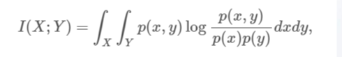
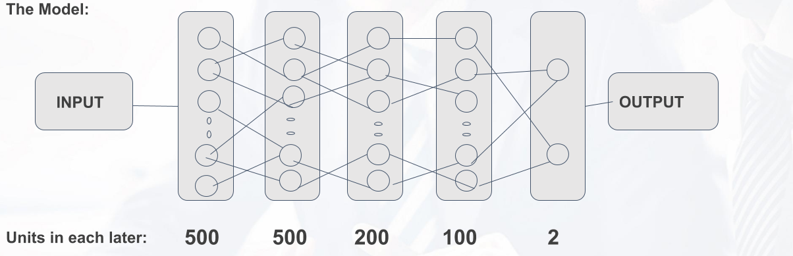
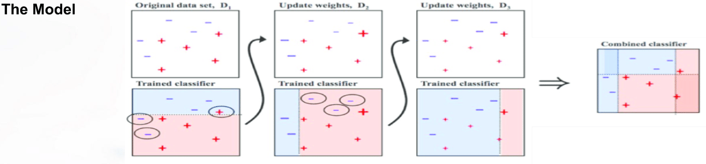

# Propensity-to-buy

## Approach Used
```
    
    * Data type check
    * Importance variable selection
    * Standardize the continuous variable(scale)
    * Neural network
    * Ada boost
```
### Mutual Information is used to select Features



### Neural Network model architecture:



## Charecteristic of the NN model:

- Optimizer : Stochastic Gradient Descent(For training Examples > 1000 it converges faster)
- Activation function : Logistic (sigmoid).
- Cost Function : Logistic Cost Function.
- Learning rate : Adaptive.
- Features selection : Select 50 best using mutual information.

### Neural Network model architecture:



## Charecteristic of the AdaBoost model:

- Optimizer : Stochastic Gradient Descent (For training examples > 1000 it converges faster).
- Cost Function : Logistic Cost Function.
- Features selection : Select 50 best using mutual information.
- Base Classifier: Decision Trees.
